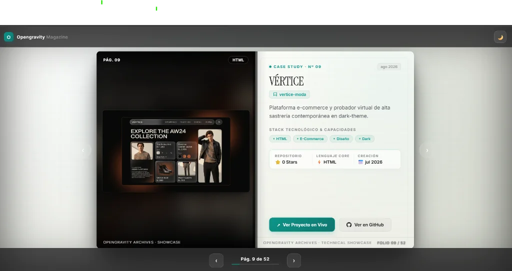

# ⬡ Opengravity — Catálogo Revista de Proyectos

> **Catálogo interactivo en formato revista digital (*Open-Spread Flip-Book*) con física tridimensional, capturas reales de proyectos y experiencia de lectura inmersiva.**

---

  

---

## 🌟 Características Principales

- 📖 **Formato Revista Abierta (Doble Página):**
  - **Página Izquierda:** Hero visual con capturas reales extraídas directamente de los `README.md` de cada repositorio.
  - **Página Derecha:** Ficha técnica editorial (*Case Study*) con stack tecnológico, estadísticas de GitHub y accesos directos.
- 🍃 **Física 3D Realista (*Leaf Flipper*):** Giro tridimensional fluido con sombras dinámicas de curvatura de papel y lomo central.
- 🧘 **Modo Lectura Inmersivo (*Zen UI*):** Interfaz limpia sin barras de distracción que se revelan suavemente al acercar el cursor a los bordes superior e inferior.
- 🌓 **Doble Tema (Light & Dark Mode):** Acabado de papel marfil satinado en modo claro y pizarra tecnológica en modo oscuro.
- ⌨️ **Navegación Intuitiva:** Soporte para flechas del teclado (`←` / `→`), clics directos sobre las páginas y controles flotantes.
- ⚡ **100% Estático y Ultrarrápido:** Construido con HTML5 semántico, Vanilla CSS3 y JavaScript moderno sin dependencias pesadas, optimizado para **GitHub Pages**.

---

## 🕹️ Controles y Navegación

| Acción | Control |
| :--- | :--- |
| **Siguiente Página** | Flecha derecha `→`, barra espaciadora o clic en `›` |
| **Página Anterior** | Flecha izquierda `←` o clic en `‹` |
| **Ir al Inicio / Portada** | Tecla `Home` |
| **Ir a la Contraportada** | Tecla `End` |
| **Mostrar Barras de Control** | Mover el ratón hacia el borde superior o inferior |
| **Cambiar Tema (Luz / Oscuro)** | Botón de luna/sol en la barra superior |

---

## 🚀 Despliegue en GitHub Pages

1. Dirígete a **Settings** > **Pages** en tu repositorio de GitHub.
2. En **Build and deployment > Source**, selecciona **Deploy from a branch**.
3. En **Branch**, elige `main` y la carpeta `/docs` (o `/ (root)`).
4. Guarda los cambios y el catálogo estará activo en:
   `https://frankusqabant.github.io/OpenGravity/`

---

  Desarrollado con pasión para el ecosistema <b>Opengravity</b> · <a href="https://github.com/FrankUsqAbant">FrankUsqAbant</a>

